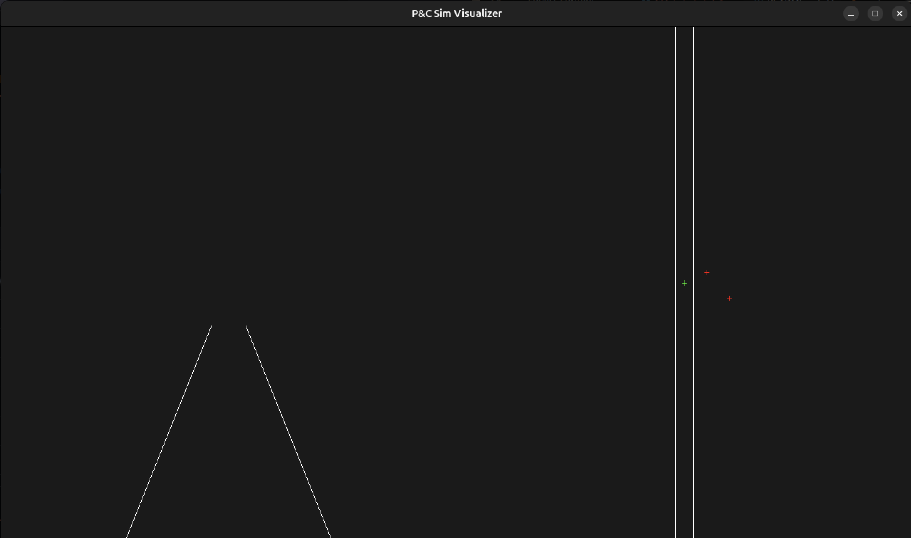

# Visualizer

Visualizer shows what the sim is currently showing the car for debug purposes. It is not very pretty - but it doesn't have to be.

It is a WIP. The sim does not currently have support for entities like signs nor does it output the necessary topics for this to read.

Also the code is pretty shotty and compile times suffer because of that but I put it together pretty quick. Will fix later (famous last words).

## Building
You'll need ROS and ap1_msgs (visualizer branch) sourced.
You'll also need glfw installed on your computer.

`colcon build`

## Running

`ros2 run ap1_pnc_sim_visualizer pnc_sim_visualizer`

## Testing with fake data

Because the sim as of yet does not publish the necessary data you can fake it using these 2 commands:

Fake entities:
```
ros2 topic pub -r 5 /sim/entities ap1_msgs/msg/EntityStateArray "
entities:
 - {x: 5.0, y: 2.0, z: 0.0}
 - {x: 10.0, y: -3.0, z: 0.0}
"
```

Fake lanes:
```
ros2 topic pub /sim/lane_boundaries ap1_msgs/msg/LaneBoundaries "
left:
  - {x: -2.0, y: -50.0, z: 0.0}
  - {x: -2.0, y:  50.0, z: 0.0}
right:
  - {x:  2.0, y: -50.0, z: 0.0}
  - {x:  2.0, y:  50.0, z: 0.0}
"
```

This will show you something like so:  
